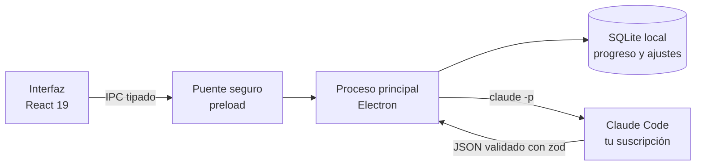

<div align="center">


# Enhome

### Aprendé inglés en casa, de a un tópico por semana, con Claude de profesor particular.

App de escritorio para Windows que te lleva del nivel **A1 al A2** del marco europeo (MCER) con práctica diaria realista —conversaciones, situaciones y tandas de traducción—, resúmenes a tu medida y exámenes semanales. Todo el material lo genera y lo revisa **Claude Code** con tu propia suscripción.


[Qué hace](#qué-hace) · [Un día de práctica](#un-día-de-práctica) · [Estilos](#estilos-visuales) · [Instalar](#instalar) · [Cómo está hecha](#cómo-está-hecha) · [Novedades](#novedades)

</div>

---

## Qué hace

| | |
|---|---|
| 🧭 **Examen inicial** | Te ubica en el temario según lo que ya sabés y arranca por el primer tópico que te cuesta. |
| 📅 **Recorrido semanal** | Un tópico por semana, un subtema por día de lunes a viernes y examen desde el viernes. Hay faltas, bloqueo, recuperación del domingo y semanas de refuerzo cuando algo no sale. |
| ✍️ **Práctica diaria** | 8 ejercicios por día entre 10 formatos, con conversaciones, situaciones reales y tandas de traducción que solo salen bien si estudiaste. |
| 📚 **Resúmenes** | 13 maneras de leer el mismo tema, modo lectura y voz que cambia sola entre español e inglés. Seleccioná cualquier texto y preguntale a Claude. |
| 📝 **Pruebas** | Examen semanal de 20 preguntas (se aprueba con 8), pausa única de 30 minutos, simulacros e historial. |
| 🔥 **Progreso** | Racha, experiencia y niveles, comodines, logros y el mapa del recorrido de A1 a B2. |
| 🎨 **Personalización** | 5 estilos completos con su logo, colores y tipografías, modo claro y oscuro, 8 paletas, 3 tipografías, tamaño, espaciado y animaciones. |
| 💬 **Comentarios** | Un cuaderno para anotar ideas, errores y lo que te gusta mientras usás la app. |

## Un día de práctica

Cada práctica tiene **8 ejercicios** que van de lo más guiado a lo más abierto. Siempre incluye una tanda de traducción y una conversación o una situación real; los días de lectura o escritura suman ese tipo.

| Formato | Qué hacés | Quién corrige |
|---|---|---|
| Opción múltiple · Completar · Ordenar · Corregir el error | Gramática del subtema, en oraciones con contexto. | La app, al instante. |
| Traducir | Una oración completa del español rioplatense al inglés. | La app si coincide con una referencia; si no, Claude. |
| **Tanda de traducción** | Una escena cotidiana contada en 3 o 4 oraciones encadenadas. | Claude, oración por oración. |
| **Conversación** | Un chat en inglés donde completás tus turnos según lo que pide cada consigna. | Claude, turno por turno. |
| **Situación real** | Un trámite, una compra o un reclamo con un objetivo y 3 o 4 pasos. | Claude, paso por paso, incluido el registro. |
| Comprensión lectora | Un texto de 90 a 140 palabras con preguntas. | La app, con puntaje parcial. |
| Escritura | Un texto con consigna concreta (A1: 35–70 palabras, A2: 60–110). | Claude, con criterios ponderados. |

Cada ejercicio se puede **cambiar** por uno equivalente, **calificar** (los formatos que más te sirven aparecen más) y, si tenés comodines, pedir una **pista**.

## Estilos visuales

| Estilo | Idea |
|---|---|
| **Celeste** | Sobrio y plano, con un guiño argentino. Es el predeterminado. |
| **Ruta** | El recorrido como una línea de subte, con un color por nivel. |
| **Cuaderno** | Hoja rayada, birome azul y resaltador. |
| **Racha** | Táctil y con energía: bordes marcados y botones que se hunden. |
| **Original** | El diseño con el que nació la app. |

El estilo pinta toda la app —también la barra de la ventana— y cambia el ícono de la barra de tareas y el de los accesos directos, que lo conservan con la app cerrada.

<table>
  <tr>
    <td></td>
    <td></td>
  </tr>
  <tr>
    <td align="center"><sub>Temario · Ruta · oscuro</sub></td>
    <td align="center"><sub>Progreso · Racha · claro</sub></td>
  </tr>
</table>

## Instalar

**Requisitos**

- Windows 10 u 11.
- [Claude Code](https://claude.com/claude-code) instalado y con sesión iniciada con una suscripción de claude.ai (Pro o superior). Sin eso, la app muestra una pantalla de bloqueo. Si está en otra ruta, indicala con la variable `CLAUDE_PATH`.
- Voces de Windows en español y en inglés para la lectura en voz alta (*Configuración → Hora e idioma → Voz → Agregar voces*).
- Node.js 22 o superior, solo para compilar.

```powershell
npm install
npm run dist
```

Genera `dist/enhome-<versión>-setup.exe`, que instala la app y crea los accesos directos.

> [!NOTE]
> La app instalada y la de desarrollo guardan el progreso en la misma carpeta (`%APPDATA%\enhome`), así que lo comparten. Solo puede haber una ventana abierta a la vez.

> [!TIP]
> El instalador no está firmado: si Windows lo bloquea con «Control de aplicaciones», permitilo desde *Seguridad de Windows*.

## Cómo está hecha



- **Nada de servidores ni API paga:** la app ejecuta Claude Code instalado en tu compu. Lo único que sale de la máquina es lo que se le consulta a Claude.
- **Doble revisión:** un docente genera el material, un revisor lo corrige y la app aplica sus propios controles automáticos antes de mostrar nada. Lo que no pasa los controles se descarta.
- **Generación en paralelo:** los ejercicios cortos y los largos se piden en tandas separadas para que ninguna respuesta quede cortada.
- **Calidad:** más de 200 tests cubren el motor de progresión, la práctica, los exámenes, las recompensas y que los estilos sigan coincidiendo con sus miniaturas.

<details>
<summary><strong>Desarrollo</strong></summary>

```powershell
npm run dev        # abre la app en modo desarrollo (con herramientas de prueba en Inicio)
npm run typecheck  # revisa tipos
npm test           # tests
npm run build      # compila sin generar el instalador
npm run icon       # regenera los íconos de los 5 estilos desde src/shared/logos.json
```

Pruebas contra Claude de verdad (gastan uso de la suscripción):

```powershell
$env:LIVE_CLAUDE = '1'; npx vitest run tests/live
```

> [!WARNING]
> Si la app no abre y aparece `Cannot read properties of undefined (reading 'isPackaged')`, la terminal tiene definida `ELECTRON_RUN_AS_NODE`. Pasa en las terminales integradas de VS Code: quitala antes de ejecutar `npm run dev`.

</details>

<details>
<summary><strong>Estructura del proyecto</strong></summary>

```
content/                  temario base (A1 y A2) y plan de B1 y B2
docs/                     documento base con todas las reglas, y capturas
build/, resources/        íconos de la app, uno por estilo
scripts/                  generación de íconos
src/main/                 proceso principal: base de datos, motor, Claude, práctica, resúmenes, pruebas y recompensas
src/preload/              puente seguro entre la interfaz y el proceso principal
src/renderer/src/styles/  base.css (estructura) · sections.css (piezas) · styles.css (los 5 estilos) · animations.css
src/renderer/             interfaz en React
src/shared/               tipos, esquemas y datos compartidos
tests/                    tests (tests/live: contra Claude real)
```

</details>

## Novedades

**1.4.0**
- Práctica más larga y exigente: 8 ejercicios por día y tres formatos nuevos (tanda de traducción, conversación y situación real) con devolución parte por parte.
- Botones de la ventana a la derecha, íconos de línea propios, animaciones suaves, sombras y foco de campos más cuidados.
- Secciones nuevas: **Comentarios** y **Acerca de**.
- Ajustes muestra una miniatura real de cada estilo.
- Correcciones: los accesos directos ya no se reescriben con cada ajuste, el selector de colores respeta el tema al instante y la alternancia entre conversación y situación funciona.

**1.3.0** · La app pasa a llamarse Enhome. **1.2.0** · Ventana propia y ícono por estilo. **1.1.0** · Ícono propio y estilos visuales.

---

<div align="center">
<sub>El diseño completo y todas las reglas están en <a href="docs/documento-base.md">docs/documento-base.md</a>.</sub>
</div>
