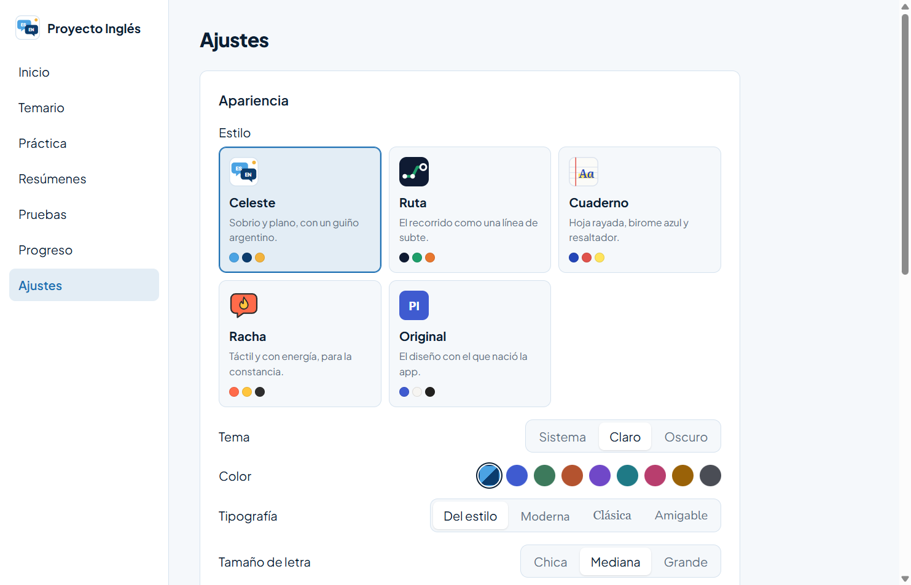
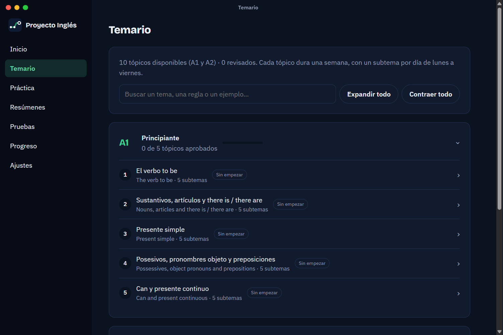
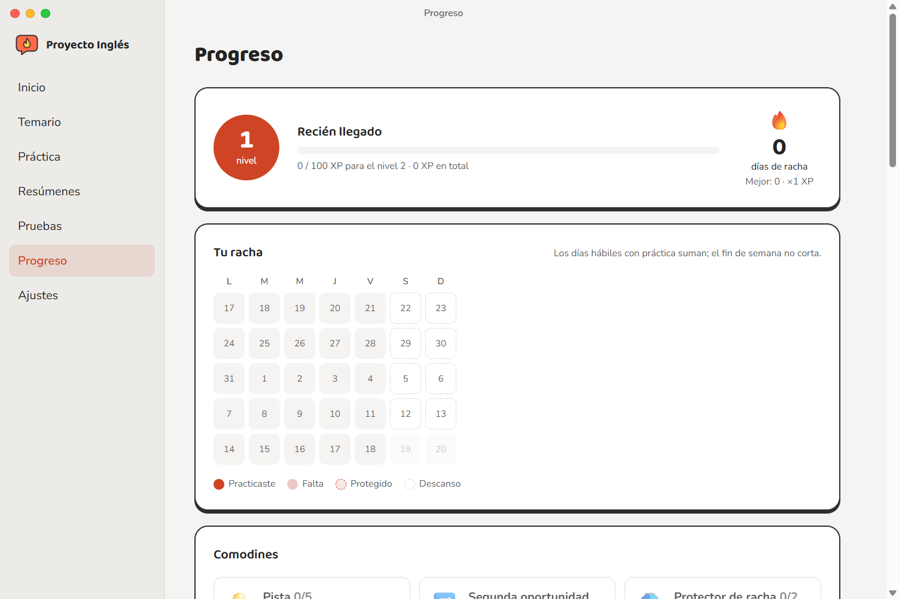

<div align="center">


# Enhome

**Aprendé inglés de A1 a A2, un tópico por semana, con Claude como profe.**

App de escritorio personal para Windows: gramática, comprensión lectora y escritura según el marco europeo (MCER), con ejercicios, resúmenes y exámenes generados y revisados por Claude Code con tu suscripción.




</div>

---

## Cómo funciona

| | |
|---|---|
| 🧭 **Examen inicial** | Te ubica en el temario según lo que ya sabés. |
| 📅 **Recorrido semanal** | Un tópico por semana y un subtema por día, de lunes a viernes. Examen desde el viernes, faltas, bloqueo, recuperación del domingo y semanas de refuerzo. |
| ✍️ **Práctica diaria** | 7 tipos de ejercicio creados por Claude y controlados por un revisor, con corrección automática o de Claude, pistas y calificación. |
| 📚 **Resúmenes** | 13 tipos, modo lectura y lectura en voz alta que cambia entre español e inglés. Seleccioná un texto y preguntale a Claude. |
| 📝 **Pruebas** | Examen semanal (se aprueba con 8) con pausa única de 30 minutos, simulacros e historial. |
| 🔥 **Progreso** | Racha, experiencia y niveles, comodines, logros y mapa del recorrido de A1 a B2. |
| 🗂️ **Temario interactivo** | Buscador, niveles desplegables y el plan de B1 y B2. |

## Estilos visuales

Cinco estilos completos, cada uno con su logo, colores, tipografías y formas, en modo claro y oscuro. Se eligen en **Ajustes**, y encima podés cambiar color, tipografía, tamaño de letra, espaciado y animaciones.

La ventana no tiene barra de Windows: la dibuja la app, sin color aparte, con los tres botones redondos a la izquierda. El estilo elegido también cambia el ícono de la barra de tareas y el del acceso directo del escritorio, que lo conserva con la app cerrada.

| Estilo | Idea |
|---|---|
| **Celeste** | Sobrio y plano, con un guiño argentino. Es el predeterminado. |
| **Ruta** | El recorrido como una línea de subte, con un color por nivel. |
| **Cuaderno** | Hoja rayada, birome azul y resaltador. |
| **Racha** | Táctil y con energía: bordes marcados y botones que se hunden. |
| **Original** | El diseño con el que nació la app. |

<table>
  <tr>
    <td></td>
    <td></td>
  </tr>
  <tr>
    <td align="center"><sub>Temario · Ruta · oscuro</sub></td>
    <td align="center"><sub>Progreso · Racha · claro</sub></td>
  </tr>
</table>

## Requisitos

- **Windows 10 u 11.**
- **[Claude Code](https://claude.com/claude-code)** instalado y con sesión iniciada con una suscripción de claude.ai (Pro o superior). Sin eso, la app muestra una pantalla de bloqueo. Si Claude Code está en otra ruta, indicala con la variable `CLAUDE_PATH`.
- **Voces de Windows** en español y en inglés para la lectura en voz alta: *Configuración → Hora e idioma → Voz → Agregar voces*.
- **Node.js 22 o superior**, solo para desarrollar.

## Instalar

```powershell
npm install
npm run dist
```

Genera `dist/enhome-<versión>-setup.exe`, que instala la app y crea el acceso directo en el escritorio.

> [!NOTE]
> La app instalada y la de desarrollo guardan el progreso en la misma carpeta (`%APPDATA%\enhome`), así que lo comparten. Solo puede haber una ventana abierta a la vez.

## Desarrollo

```powershell
npm run dev        # abre la app en modo desarrollo (con herramientas de prueba en Inicio)
npm run typecheck  # revisa tipos
npm test           # tests
npm run build      # compila sin generar el instalador
npm run icon       # regenera el ícono (build/icon.ico y resources/icon.png) desde el logo Celeste
```

Pruebas contra Claude de verdad (gastan uso de la suscripción):

```powershell
$env:LIVE_CLAUDE = '1'; npx vitest run tests/live
```

> [!WARNING]
> Si la app no abre y aparece `Cannot read properties of undefined (reading 'isPackaged')`, la terminal tiene definida `ELECTRON_RUN_AS_NODE`. Pasa en las terminales integradas de VS Code: quitala antes de ejecutar `npm run dev`.

<details>
<summary><strong>Estructura del proyecto</strong></summary>

```
content/            temario base (A1 y A2) y plan de niveles futuros
docs/               documento base con todas las reglas y capturas
build/, resources/  ícono de la app
scripts/            utilidades (generación del ícono)
src/main/           proceso principal: base de datos, motor, Claude, práctica, resúmenes, pruebas y recompensas
src/preload/        puente seguro entre la interfaz y el proceso principal
src/renderer/       interfaz en React
src/shared/         tipos y utilidades compartidas
tests/              tests (tests/live: contra Claude real)
```

</details>

<details>
<summary><strong>Cómo usa a Claude</strong></summary>

La app no usa la API paga: ejecuta Claude Code instalado en la compu (`claude -p`) con la suscripción del usuario. Todo lo que genera pasa por una autorrevisión en el mismo pedido, un segundo pedido que actúa de revisor y controles automáticos locales antes de mostrarse.

</details>

El diseño completo y todas las reglas están en [docs/documento-base.md](docs/documento-base.md).
